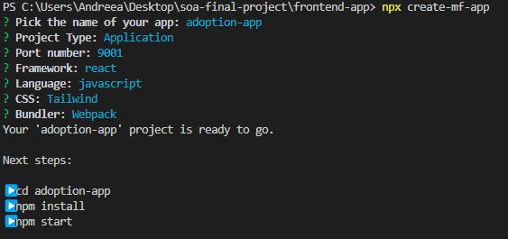
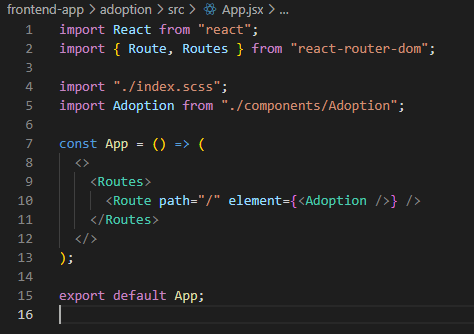
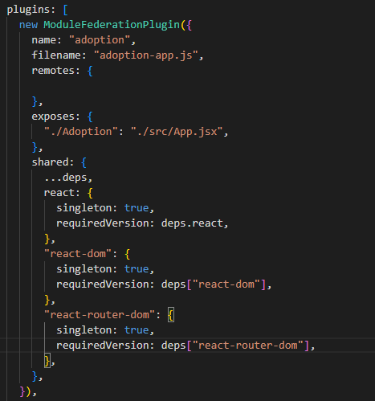
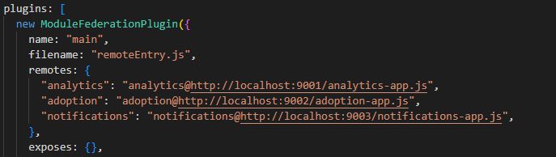
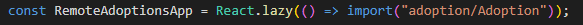
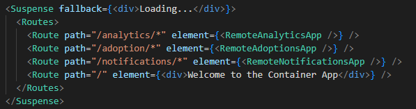
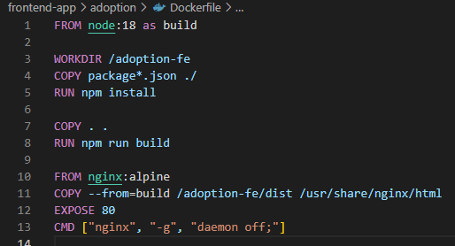
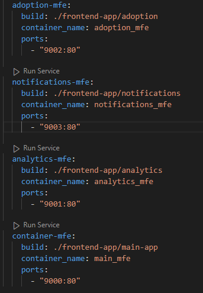

# Micro Frontends in React with Webpack 5 with Module Federation

This tutorial provides a simple, **step-by-step** approach to setting up multiple **micro frontends (MFEs)** in a single application.

---

## 1. Introduction

A **micro frontend** architecture breaks a large web app into smaller, autonomous UI applications, each focusing on a distinct feature. For example, in an **Adoption System**, we have:

1. **Main MFE** – A landing page or home screen for general navigation.
2. **Adoption MFE** – Manages animal listings and adoption requests.
3. **Analytics MFE** – Displays real-time analytics or dashboards.
4. **Notifications MFE** – Shows live status updates and notifications.

Each MFE can be built, tested, and deployed **independently**, improving team autonomy and reducing risk when shipping new features.

---

## 2. Setting up the MFEs

1. Create the application with the command: **npx create-mf-app**

2. Now, you have to build the app with whatever components you need.
3. Make sure to have the routes you need. 

4. Then, in **webpack.config.js** add the ModuleFederationPlugin, exposing your routes.

5. Create the main application, where you will centralize all the others and add them as remotes in the ModuleFederationPlugin in **webpack.config.js**.

6. For using the micro frontends you have to lazy load them in the main app. 

7. Then you can use them like this, but keep in mind to add a Suspense component to see until the components are loaded.

## Deployment

1. Each micro frontend app(including the main one) should have a **Dockerfile** to install dependencies, build the application and copy the files.

2. Then add the containers in the **docker-compose.yml** file with the settings you need.

3. After doing all this steps and running the **docker compose up --build** command, you should be able to access the main app containing all the other apps.
